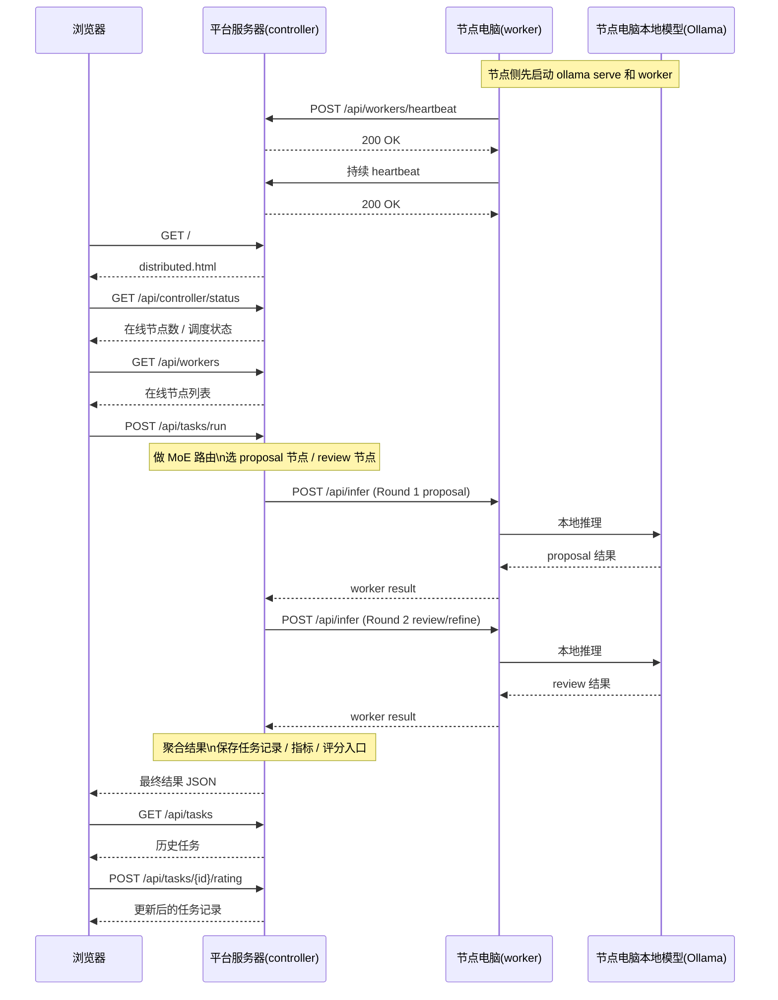

# 节点接入与平台交互说明

## 平台服务器 / 节点电脑 / 浏览器 交互时序图



## 整体接入逻辑

1. 平台服务器运行 controller，负责：
   - 提供前端页面
   - 接收节点 heartbeat
   - 维护在线节点状态
   - 执行 MoE 路由
   - 执行 MoA 两轮聚合
   - 保存任务和指标

2. 节点电脑运行：
   - 本地 Ollama
   - 本地 worker

3. worker 启动后持续向 controller 发送 heartbeat：
   - `POST /api/workers/heartbeat`

4. 用户在浏览器页面提交任务后：
   - 浏览器调用 controller
   - controller 根据在线节点做路由
   - controller 反向调用各节点 `POST /api/infer`
   - worker 再调用本机 Ollama 推理
   - 结果返回 controller
   - controller 聚合并展示

## 节点接入排障清单

1. controller 是否在线
   - 打开 `http://31.97.191.47:8010/`
   - 打开 `http://31.97.191.47:8010/api/controller/status`

2. 节点电脑本地 Ollama 是否启动
```bash
ollama serve
curl http://127.0.0.1:11434/api/tags
```

3. 模型是否已下载
```bash
ollama list
```

4. `--controller-url` 是否错误写成 `127.0.0.1`
   - 如果 controller 在远程服务器，必须写成服务器地址
   - 例如：`http://31.97.191.47:8010`

5. `--public-url` 是否是 controller 真能访问到的节点地址
   - 不能随便写 `127.0.0.1`
   - 应写成节点电脑自己的可访问 IP

6. worker 是否真的在运行
```bash
ps aux | grep swarmos_demo.worker
```

7. 节点端口是否监听
```bash
lsof -i :8021
```
或
```bash
ss -ltnp | grep 8021
```

8. 节点防火墙是否放行端口
   - 检查本机防火墙
   - 检查路由器 / NAT / 安全组

9. 如果页面数量还是 0，优先检查：
   - `CONTROLLER_URL` 是否写成服务器地址
   - `PUBLIC_HOST` 是否是节点电脑真实 IP
   - 本机 `8021` 端口是否被拦住

10. 如果节点上线了但任务失败，优先检查：
   - `public_url` 是否可被 controller 回调
   - `ollama serve` 是否仍然活着
   - 模型是否真的存在
   - worker 是否还在运行

## 推荐最小接入命令

全新电脑第一次接入：

```bash
CONTROLLER_URL=http://31.97.191.47:8010 \
PUBLIC_HOST=你的节点IP \
bash -c "$(curl -fsSL https://raw.githubusercontent.com/jacob-ww22213/SwarmForge/main/scripts/bootstrap-node.sh)"
```
