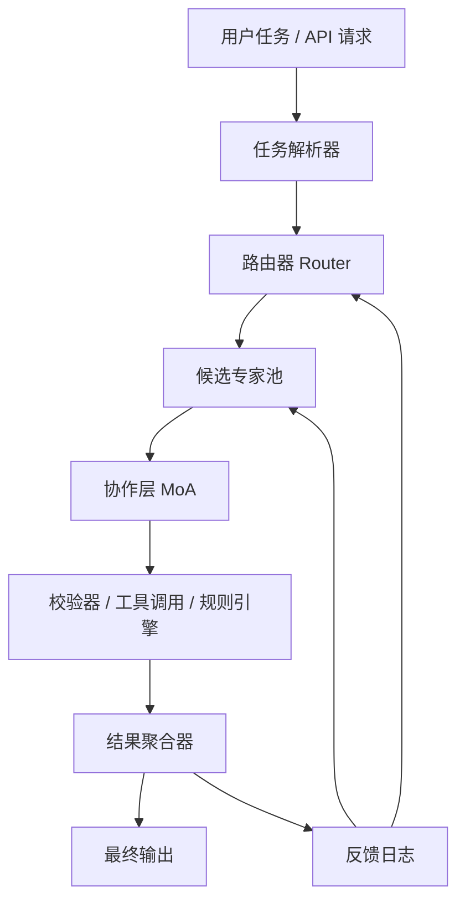

# 群智引擎 SwarmOS
## 技术白皮书版

## 1. 摘要
群智引擎 SwarmOS 是一种面向复杂任务推理的分布式智能系统架构。它不把全部能力压缩在单个超大模型里，而是将海量专精小模型组织成一个可路由、可协作、可验证、可持续扩容的系统。  

系统的核心目标有三个：

1. 在单位成本可控的前提下，提升复杂任务质量与稳定性
2. 在企业场景中兼顾私有化部署、模块化升级和可审计性
3. 通过专家网络与协作机制形成长期可扩展的智能基础设施

## 2. 问题定义
单体大模型在通用问答和单轮生成任务上表现突出，但在以下场景会暴露明显限制：

- 复杂任务需要多步骤分解、相互校验和长程规划
- 不同行业需要高度专精的知识与术语处理能力
- 企业需要低成本、可控、可替换和可私有化部署
- 系统需要随着业务增长持续接入新能力，而不是整体重训

因此，我们提出一个新的系统假设：

**复杂智能能力不一定来自单个更大的模型，也可以来自大量专精模型在高效组织下形成的系统级协同。**

## 3. 设计原则
SwarmOS 基于以下设计原则：

1. **稀疏激活优先**  
系统容量可以很大，但单次推理只调用必要的少数模块。

2. **专精优先于全能**  
把任务能力拆给多个专家，而不是要求一个模型在所有维度都最优。

3. **协作优先于单次输出**  
复杂任务通过多轮提案、批判、整合和校验提升质量。

4. **验证优先于自信**  
最终结果必须允许被外部工具、规则或次级专家验证。

5. **可演化优先于一次成型**  
系统应支持新增专家、替换专家、重训路由器和迭代协作策略。

## 4. 整体架构
SwarmOS 由五个核心子系统构成：

1. 专家层 Expert Layer
2. 路由层 Routing Layer
3. 协作层 Collaboration Layer
4. 校验与记忆层 Verification and Memory Layer
5. 编排与服务层 Orchestration and Serving Layer



## 5. 专家层设计
### 5.1 专家定义
专家是参数规模较小但经过明确专精训练的模型单元。单个专家通常专注于以下维度之一：

- 学科领域，如数学、代码、医学、法律、金融
- 任务类型，如分类、改写、规划、检索、总结、批判
- 数据域，如企业私有知识库、内部工单、专用文档集
- 输出风格，如正式报告、结构化 JSON、可执行步骤

### 5.2 专家粒度
我们不建议一开始就追求“10 万个专家”的规模。更合理的工程路径是：

- 原型阶段：20 到 100 个专家
- 平台阶段：100 到 1000 个专家
- 网络阶段：1000+ 专家，并引入自动发现与淘汰机制

### 5.3 专家生命周期
每个专家需要纳入统一生命周期管理：

1. 注册能力描述
2. 绑定适用任务标签
3. 持续评估质量与延迟
4. 根据表现升级、降级或淘汰

## 6. 路由层设计
### 6.1 路由目标
路由层的作用不是“找到唯一正确模型”，而是：

- 选出最有可能有效的专家子集
- 控制调用成本与时延
- 保证专家组合具有多样性与互补性

### 6.2 路由输入
路由器可基于以下信息工作：

- 用户输入文本
- 任务类型标签
- 历史对话上下文
- 企业租户配置
- 过去类似任务的成功路径
- 当前系统负载与 SLA

### 6.3 路由输出
路由器输出的不是单一目标，而是结构化执行计划：

- 候选专家列表
- 每个专家的优先级与预算
- 是否需要检索、工具调用或人类审核
- 协作深度和最大轮数

### 6.4 路由训练
路由器可由多种方式联合优化：

- 监督学习：利用历史任务到最优专家路径的映射
- Bandit / 强化学习：根据真实任务收益调整路由策略
- 规则约束：在人类设定的场景下强制激活或禁用某些专家

## 7. 协作层设计
### 7.1 协作目的
协作层解决的核心问题是：  
单个专家可能给出局部最优、片面或带幻觉的答案，但多个专家在受控机制下互相提供补充和约束，能够提升系统级输出质量。

### 7.2 协作机制
一个标准协作回合包含四步：

1. **并行提案**  
多个专家独立给出解答、假设或子计划。

2. **交叉批判**  
批判型专家或同类专家识别漏洞、冲突和风险点。

3. **聚合重写**  
聚合器根据证据权重、专家信誉和一致性重写答案。

4. **外部校验**  
通过检索、工具执行、规则引擎或程序验证结果的关键环节。

### 7.3 协作深度控制
不是所有任务都需要深度协作。协作深度应随任务复杂度动态调节：

- 简单任务：单专家直出
- 中等任务：少量专家并行 + 一轮聚合
- 高风险任务：多专家多轮协作 + 外部验证 + 审计日志

## 8. 校验与记忆层
### 8.1 校验机制
校验层可以包含：

- 检索增强验证
- 规则模板验证
- 代码执行验证
- 结构化输出验证
- 特殊领域的守门专家

### 8.2 记忆机制
记忆层记录系统在真实任务中的表现，用于：

- 更新专家信誉分
- 改进路由策略
- 保存高质量协作轨迹
- 发现缺失能力并触发新专家训练

## 9. 编排与服务层
服务层负责把模型系统转化为生产级基础设施，主要包括：

- API 接口与租户隔离
- 任务队列与优先级调度
- GPU / CPU 混合资源分配
- 结果缓存
- 监控、告警和追踪
- 多地区或边缘节点部署

可选技术栈示例：

- 调度与编排：Kubernetes、Ray
- 推理服务：vLLM、TensorRT-LLM、SGLang
- 数据与日志：Postgres、ClickHouse、对象存储
- 观测系统：Prometheus、Grafana、OpenTelemetry

## 10. 参考推理流程
```text
输入任务
-> 任务解析
-> 路由器选择专家子集
-> 并行调用专家生成候选解
-> 批判/校验专家识别问题
-> 聚合器重写并排序答案
-> 必要时调用外部工具验证
-> 输出最终结果并记录反馈
```

## 11. 伪代码示例
```python
def solve(task, context):
    plan = router.select(task=task, context=context)
    candidates = []

    for expert in plan.primary_experts:
        candidates.append(expert.generate(task, context))

    critiques = []
    for reviewer in plan.reviewer_experts:
        critiques.append(reviewer.review(task, candidates, context))

    merged = aggregator.merge(
        task=task,
        candidates=candidates,
        critiques=critiques,
        policy=plan.merge_policy,
    )

    if plan.needs_verification:
        merged = verifier.check(task, merged, context)

    memory.log(task=task, plan=plan, output=merged)
    return merged
```

## 12. 关键技术创新点
SwarmOS 的创新不在于某一个单独算法，而在于以下组合：

1. **大规模专家注册与调度框架**
2. **面向真实任务收益的动态路由**
3. **多层协作与批判式聚合机制**
4. **结果校验与任务反馈回流**
5. **支持新增专家的持续演化能力**

## 13. 评估指标
正式评估不应只看通用问答分数，而要同时覆盖：

- 任务成功率
- 单任务成本
- 平均延迟与尾延迟
- 事实性错误率
- 结构化输出通过率
- 企业场景人工复核通过率
- 路由准确率
- 协作收益比

建议设置一个关键指标：

**每增加一单位计算成本，SwarmOS 是否能比单模型带来更高的质量提升。**

## 14. 风险与挑战
### 14.1 通信成本
专家数量越多，系统越容易被通信和上下文拼接拖慢。  
解决方向：稀疏激活、短上下文摘要、中间状态压缩和分层协作。

### 14.2 噪声累积
多专家不一定带来更好结果，错误也可能被放大。  
解决方向：批判专家、外部验证、信誉加权和早停机制。

### 14.3 路由器成为瓶颈
如果路由器选择失误，后续一切努力都会打折。  
解决方向：离线回放评估、在线反馈优化、多路候选路由与预算控制。

### 14.4 工程复杂度
系统复杂度显著高于调用单个模型。  
解决方向：先在高价值复杂任务中使用，再逐步推广到广域场景。

## 15. 路线图建议
### 阶段 A：原型验证
- 构建 20 到 50 个专家
- 验证在一个垂直任务上显著超过单模型

### 阶段 B：系统强化
- 上线路由器、批判专家、校验器和统一日志
- 建立标准任务集和回放框架

### 阶段 C：平台扩展
- 扩展到数百专家
- 支持第三方能力接入
- 形成可运营的智能基础设施平台

## 16. 结论
SwarmOS 提出了一条不同于“更大单体模型”的智能系统路线：  
通过大量专精小模型、稀疏路由、多轮协作和结果验证，构建一个具备系统级智能演化能力的分布式平台。

在这个框架中，真正的竞争力不是“总参数有多大”，而是：

- 专家组织得有多好
- 路由选择得有多准
- 协作机制设计得有多高效
- 反馈闭环跑得有多稳定

如果这些问题被系统性解决，那么“小模型社会”完全有机会成为下一代 AI 基础设施的重要形态。
